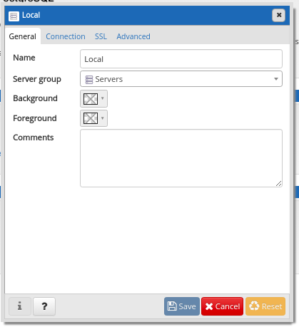

# Rodando PostGreSQL - PGAdmin em Docker

### Criando o volume
```
docker volume create postgresql_vol
```
### Criando a rede
```
docker network create --driver bridge postgres-network
```
### Subindo o Container de Banco
```
docker container run -d --name postgres --network postgres-network  -e POSTGRES_PASSWORD=pgpwd -e POSTGRES_USER=pguser -p 5432:5432   -v postgresql_vol:/vol/postgresql/data postgres

```
### Subindo o Container do PHPAdmin na porta 8080
```
docker container run  --name teste-pgadmin -d --network postgres-network -p 5050:5050 fenglc/pgadmin4:latest

docker run --name teste-pgadmin --network=postgres-network -p 15432:80 -e "PGADMIN_DEFAULT_EMAIL=renatogroff@yahoo.com.br" -e "PGADMIN_DEFAULT_PASSWORD=PgAdmin2018!" -d dpage/pgadmin4

```
### php MyAdmin


### php Conexão


### php Parâmetro
